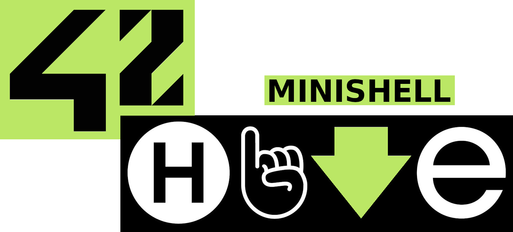
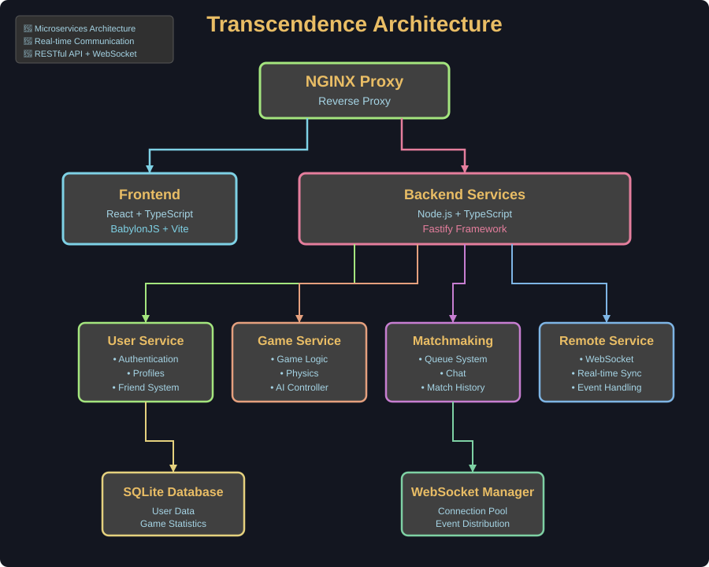

<h1 align="center">
  
</h1>

<p align="center">
  <b><i>Fullstack multiplayer Pong game with 3D graphics and social features 🏓</i></b><br>
</p>

<p align="center">
  
  
  
</p>

<p align="center">
  
  
</p>

<div align="center">

## 📋 Table of Contents

[📖 Overview](#-overview) |
[✨ Features](#-features) |
[🏗️ Architecture](#️-architecture) |
[🛠️ Build](#️-build) |
[⚡ Usage](#-usage) |
[🎮 Gameplay](#-gameplay) |
[♻️ Tech Stack](#️-tech-stack)

</div>

## 📖 Overview

**ft_transcendence** is the final project of the 42 common core curriculum. The goal is to create a web application Pong game with modern web technologies.

This implementation features a microservices architecture with separate services for game logic, matchmaking, user management, and real-time communication. The game is rendered in 3D using BabylonJS and supports multiple game modes including 1v1 matches, AI opponents, and tournament brackets as well as social features.

<p align="center">
  <video src="assets/demonstration.mp4" width="800" controls autoplay muted loop>
    Your browser does not support the video tag.
  </video>
</p>

## ✨ Features

### 🎮 Game Features

- **Real-time Multiplayer** - Play against other players with WebSocket-based networking
- **3D Graphics** - 3D rendered gameplay using BabylonJS engine
- **Power-ups System** - Dynamic power-ups that affect gameplay
- **AI Opponent** - Play against computer-controlled opponent
- **Tournament Mode** - Compete in bracket-style tournaments
- **Matchmaking** - Automated queue based matchmaking

### 👥 Social Features

- **User Authentication** - Secure login and registration system
- **Friend System** - Add friends and track their status
- **Real-time Chat** - Chat with other players using livechat
- **User Profiles** - Customizable profiles with avatars and statistics
- **Match History** - Track your wins, losses, and game statistics

### 🎨 UI/UX Features

- **Responsive Design** - Works seamlessly on desktop and mobile
- **Audio System** - Immersive sound effects and background music
- **Graphics Settings** - Adjust visual quality for performance
- **Retro Style** - Classic original and aesthetic 2D feel

## 🏗️ Architecture

The project follows a microservices architecture pattern with the following services:

<p align="center">
  
</p>

### Services Breakdown

**Frontend** (`/frontend`)

- ⚛️ React + TypeScript with Vite
- 🎮 BabylonJS for 3D game rendering
- 📦 Context API for state management
- 🔌 WebSocket integration for real-time features

**User Service** (`/backend/services/user_service`)

- 🔐 Authentication (JWT-based)
- 👤 User profile management
- 👥 Friend system
- 🎫 Session management

**Game Service** (`/backend/services/game_service`)

- 🎯 Core Pong game logic
- ⚙️ Physics simulation
- ⭐ Power-up management
- 🤖 AI controller

**Matchmaking Service** (`/backend/services/matchmaking_service`)

- 📋 Player queue management
- 🎲 Game session creation
- 💬 Chat functionality
- 📊 Match history tracking

**Remote Service** (`/backend/services/remote_service`)

- 🔌 WebSocket event handling
- 🔄 Real-time game state synchronization
- 📡 Chat message distribution

**Main Server** (`/backend/services/main_server`)

- 🚪 API gateway
- 👨‍💼 Admin functionality
- 🛣️ Request routing
- ⚠️ Error handling

## 🛠️ Build

The project uses Docker for deployment. Make sure you have `docker` and `docker-compose` installed.

```bash
# Clone the repository
git clone https://github.com/Jarnomer/transcendence.git
cd ft_transcendence
make all
```

The application will be available at:

- Frontend: `http://localhost:3000`
- Backend API: `http://localhost:4000`

### Development Build

For development with hot-reload:

```bash
# Install dependencies
pnpm install

# Start backend services
cd backend && pnpm dev

# Start frontend (in another terminal)
cd frontend && pnpm dev
```

## ⚡ Usage

### Creating an Account

1. Navigate to `http://localhost:3000`.
2. Click "Sign Up" and create an account.
3. Customize your profile and upload an avatar.
4. Begin to Pong!

### Playing Games

**Quick Match** ⚡

```
Home → Play → Quick Match
```

Join the matchmaking queue and get paired with an opponent.

**Play vs AI** 🤖

```
Home → Play → vs AI
```

Practice against computer-controlled opponents.

**Challenge Friend** 🎯

```
Home → Friends → Select Friend → Challenge
```

Send a direct challenge to online friends.

**Tournament** 🏆

```
Home → Tournament → Create/Join Tournament
```

Compete in bracket-style tournaments with multiple players.

### Game Controls

- **Move Paddle**: Arrow Keys (↑/↓) or W/S

## 🎮 Gameplay

### Pong Rules

- First player to reach full points wins
- Ball speed increases after each paddle hit
- Ball spin is influenced by paddle movement
- Power-ups spawn randomly during gameplay

### Power-ups

| Icon | Name           | Effect                      | Duration   |
| ---- | -------------- | --------------------------- | ---------- |
| 🏓+  | Bigger Paddle  | Increases paddle size       | 10 seconds |
| 🏓-  | Smaller Paddle | Decreases opponent's paddle | 10 seconds |
| ⚡+  | Faster Paddle  | Increases paddle speed      | 10 seconds |
| ⚡-  | Slower Paddle  | Decreases opponent's speed  | 10 seconds |
| 🌀   | More Spin      | Enhanced ball control       | 10 seconds |

### Tournament Format

- Single elimination bracket
- 4, 8, or 16 player tournaments
- Best of 1 matches
- Champion crowned at the end

## ♻️ Tech Stack

### Frontend

- **React 18** - UI framework
- **TypeScript** - Type safety
- **Vite** - Build tool and dev server
- **BabylonJS** - 3D game engine
- **TailwindCSS** - Utility-first CSS

### Backend

- **Node.js** - JavaScript runtime
- **TypeScript** - Type safety
- **Fastify** - Fast web framework
- **WebSocket** - Real-time communication
- **SQLite** - Embedded database
- **JWT** - Authentication tokens

### Infrastructure

- **Docker** - Containerization
- **Docker Compose** - Multi-container orchestration
- **Nginx** - Reverse proxy
- **pnpm** - Fast package manager

### DevOps & Testing

- **Playwright** - End-to-end testing
- **ESLint** - Code linting
- **Prettier** - Code formatting

## 🎯 Project Modules

This project implements the following 42 modules:

### Major Modules

- ✅ **Backend Framework** - Node.js with Fastify
- ✅ **Standard User Management** - Authentication, profiles
- ✅ **Server-Side Pong** - Game logic on backend
- ✅ **Remote Players** - WebSocket multiplayer
- ✅ **AI Opponent** - Computer-controlled player
- ✅ **Live Chat** - Real-time messaging system
- ✅ **Advanced 3D Graphics** - Custom shaders and effects

### Minor Modules

- ✅ **Front-end framework** - React
- ✅ **Backend database** - SQLite
- ✅ **Game Customization Options** - Settings and preferences
- ✅ **Browser Compatibility** - Pong with statistics
- ✅ **Device Support** - Statistics tracking

## 👨‍💻 Team

This project was developed by: [Janrau](https://github.com/janrau9) • [Lassi](https://github.com/lassikon) • [Olli](https://github.com/koodikommando) • [Jarno](https://github.com/Jarnomer)

## 📝 License

This project is part of the 42 school curriculum.

## 4️⃣2️⃣ Footer

Wanna join Hive 🐝 and start coding? Visit their [homepage](https://www.hive.fi/).

### Good luck and have fun! 🎉
